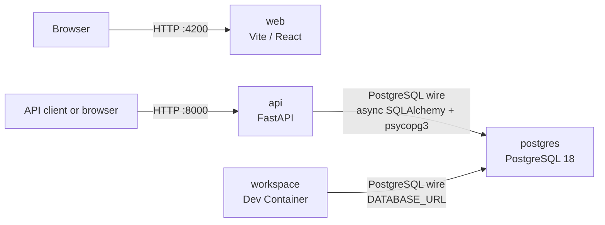

# Architecture

## Workspace

Nx monorepo managed with pnpm. Projects live under `projects/` and are scaffolded with Nx generators; never hand-write a new `project.json`. See [`references/nx-guidelines.md`](references/nx-guidelines.md). Tooling includes Biome, Vitest, Playwright, Storybook, and `@nxlv/python` with uv. TypeScript 7 supplies `tsc`, while the aliased TypeScript 6 package supplies the programmatic compiler API required by Nx and Vite. The [quality workflow](../.github/workflows/quality.yml) checks sync, lint, typechecking, tests, builds, and repository-authored documentation without Nx Cloud. Pi project configuration lives under [`.pi/`](../.pi/), Agent Skills under [`.agents/skills/`](../.agents/skills/), and workspace policy in [`AGENTS.md`](../AGENTS.md).

## Projects

| Project                             | Type                        | Stack                                                                                    | Start here                                                                                    |
| ----------------------------------- | --------------------------- | ---------------------------------------------------------------------------------------- | --------------------------------------------------------------------------------------------- |
| [`web`](../projects/web/)           | React SPA                   | React 19, Vite 8, Tailwind v4, daisyUI v5, TanStack Router, TanStack Query, Paraglide JS | [`README.md`](../projects/web/README.md) · [`AGENTS.md`](../projects/web/AGENTS.md)           |
| [`web-e2e`](../projects/web-e2e/)   | Playwright end-to-end tests | Playwright                                                                               | [`README.md`](../projects/web-e2e/README.md) · [`AGENTS.md`](../projects/web-e2e/AGENTS.md)   |
| [`api`](../projects/api/)           | FastAPI service             | Python 3.14, uv, FastAPI, uvicorn, pytest, Ruff, async SQLAlchemy, psycopg3              | [`README.md`](../projects/api/README.md) · [`AGENTS.md`](../projects/api/AGENTS.md)           |
| [`postgres`](../projects/postgres/) | Infrastructure image        | PostgreSQL 18, pgvector, Apache AGE                                                      | [`README.md`](../projects/postgres/README.md) · [`AGENTS.md`](../projects/postgres/AGENTS.md) |

## Local topology

[`compose.yml`](../compose.yml) defines the root `postgres`, `api`, and `web` services. `web` is served independently on port 4200 and has no configured backend connection. `api` listens on port 8000 and is the only application service with a network dependency: PostgreSQL on port 5432. Use `docker compose up --build` to start the root stack; use `docker compose watch` to sync the configured web source files for Vite HMR.

The [Dev Container workspace](../.devcontainer/README.md) layers `.devcontainer/compose.yml` after the root Compose file. It starts only a `workspace` development shell and healthy `postgres`; `api` and `web` run through Nx inside `workspace` when needed. The workspace-run API uses the Compose DNS name `postgres`. This is a development connection, not a browser-to-API connection. Docker-outside-of-Docker gives trusted workspace users host-daemon authority; it is not a sandbox.

The default Dev Container does not read host Pi state. Its explicit host Pi opt-in adds read-only bind mounts for the user's global Pi `extensions/` directory, `settings.json` file, and configured CA certificate. The opt-in forwards `NODE_EXTRA_CA_CERTS` so Pi's Node runtime trusts the mounted CA. It does not mount Pi authentication or host package trees. Global package downloads and Git checkouts use container-owned Linux named volumes, separate from project Pi package/worktree volumes. See the [Dev Container guide](../.devcontainer/README.md#opt-in-to-user-level-pi-extensions) for activation and trust limits.

| From        | To         | Protocol        | Notes                                                                                                                                      |
| ----------- | ---------- | --------------- | ------------------------------------------------------------------------------------------------------------------------------------------ |
| Client      | `web`      | HTTP, port 4200 | Root Compose development container; source sync is available through `docker compose watch`.                                               |
| Client      | `api`      | HTTP, port 8000 | FastAPI service. `GET /api/v1/health/ready` checks database connectivity.                                                                  |
| `api`       | `postgres` | PostgreSQL wire | Async SQLAlchemy + psycopg3. `DATABASE_URL` defaults to a localhost DSN outside Compose; root Compose points it to the `postgres` service. |
| `workspace` | `postgres` | PostgreSQL wire | Dev Container development shell. Its Compose layer derives `DATABASE_URL` from `POSTGRES_*` and uses `postgres` as the host.               |

See [0001: Compose-backed Dev Container workspace](design-docs/0001-devcontainer-workspace.md) for the workspace decision and [environment variables](references/environment-variables.md) for defaults and consumers. When a service starts communicating with another service over HTTP, a database connection, or an external API, write a [design document](design-docs/README.md) first and then record the resulting connection here.
