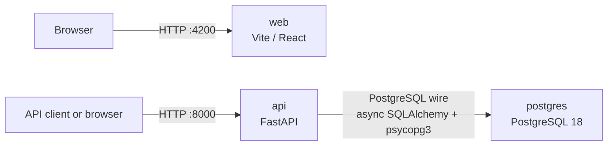

# Architecture

## Workspace

Nx monorepo managed with pnpm. Projects live under `projects/` and are scaffolded with Nx generators; never hand-write a new `project.json`. See [`references/nx-guidelines.md`](references/nx-guidelines.md). Tooling includes Biome, Vitest, Playwright, Storybook, and `@nxlv/python` with uv. Pi project configuration lives under [`.pi/`](../.pi/), Agent Skills under [`.agents/skills/`](../.agents/skills/), and workspace policy in [`AGENTS.md`](../AGENTS.md).

## Projects

| Project | Type | Stack | Start here |
| --- | --- | --- | --- |
| [`web`](../projects/web/) | React SPA | React 19, Vite 8, Tailwind v4, daisyUI v5, TanStack Router, TanStack Query, Paraglide JS | [`README.md`](../projects/web/README.md) · [`AGENTS.md`](../projects/web/AGENTS.md) |
| [`web-e2e`](../projects/web-e2e/) | Playwright end-to-end tests | Playwright | [`README.md`](../projects/web-e2e/README.md) · [`AGENTS.md`](../projects/web-e2e/AGENTS.md) |
| [`api`](../projects/api/) | FastAPI service | Python 3.14, uv, FastAPI, uvicorn, pytest, Ruff, async SQLAlchemy, psycopg3 | [`README.md`](../projects/api/README.md) · [`AGENTS.md`](../projects/api/AGENTS.md) |
| [`postgres`](../projects/postgres/) | Infrastructure image | PostgreSQL 18, pgvector, Apache AGE | [`README.md`](../projects/postgres/README.md) · [`AGENTS.md`](../projects/postgres/AGENTS.md) |

## Local topology

`compose.yml` defines three local containers. `web` is served independently on port 4200 and has no configured backend connection. `api` listens on port 8000 and is the only service with a network dependency: PostgreSQL on port 5432. Use `docker compose up --build` to start the stack; use `docker compose watch` to sync the configured web source files for Vite HMR.

| From | To | Protocol | Notes |
| --- | --- | --- | --- |
| Client | `web` | HTTP, port 4200 | Compose development container; source sync is available through `docker compose watch`. |
| Client | `api` | HTTP, port 8000 | FastAPI service. `GET /api/v1/health/ready` checks database connectivity. |
| `api` | `postgres` | PostgreSQL wire | Async SQLAlchemy + psycopg3. `DATABASE_URL` defaults to a localhost DSN outside Compose; Compose points it to the `postgres` service. |

When a service starts communicating with another service over HTTP, a database connection, or an external API, write a [design document](design-docs/README.md) first and then record the resulting connection here. See [environment variables](references/environment-variables.md) for defaults and consumers.
