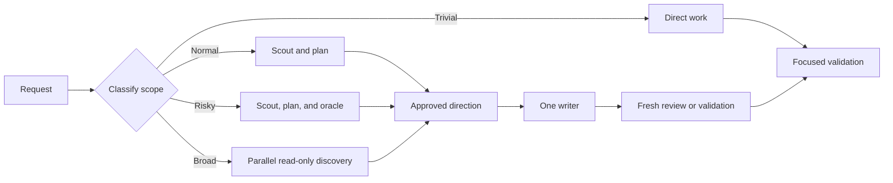

# Delegation

Use this page after reading the workspace and nearest-project `AGENTS.md` files. It defines how a parent session delegates work; [`AGENTS.md`](../../AGENTS.md) remains the mandatory policy.

## Roles

| Agent | Best use | Writes project files? |
| --- | --- | --- |
| `scout` | Local reconnaissance: entry points, tests, data flow, and risks | No |
| `researcher` | Evidence-backed external research | No |
| `planner` | An implementation plan based on established context | No |
| `oracle` | An advisory challenge to risky or ambiguous decisions | No |
| `context-builder` | Broad, cross-cutting handoff material | No |
| `worker` | An approved implementation and focused validation | Yes |
| `reviewer` | Evidence-backed plan or diff review | Only when explicitly authorized |
| `delegate` | A focused task that does not fit another role | Task-dependent |
| `technical-writer` | Substantial repository documentation work | Yes |

The first eight roles come from `pi-subagents`; `technical-writer` is this repository's project agent. Inspect the available agents before launching one because package and project configuration determine the effective roster.

## Choose a workflow

| Scope | Workflow | Use it when |
| --- | --- | --- |
| Trivial | Work directly → focused validation → reviewer | The change is local, clear, and low risk. |
| Normal | Scout → planner → worker → fresh reviewer → worker | Behavior changes or unfamiliar code benefit from an independent plan and review. |
| Risky or ambiguous | Scout → planner → oracle → approved direction → worker → parallel fresh reviewers → worker | Architecture, security, migration, rollback, or unclear requirements need a challenge before implementation. |
| Broad but separable | Parallel read-only scouts/reviewers → one writer → parallel fresh validators | Several independent areas need investigation or validation. |



## Guardrails

- Load the `pi-subagents` skill before orchestrating. The parent owns scope, synthesis, final decisions, and follow-up work.
- Give every child a concrete goal, relevant files or evidence, success criteria, validation, output shape, and stop rules. Ordinary children do not spawn children.
- Keep one writer in a shared checkout. Parallel work is read-only unless isolated worktrees are deliberately used from a clean tree.
- Use fresh context for independent exploration and review. Use forked context only when the child needs the approved session history.
- Reviewers inspect the actual files, plan, or diff and return evidence with paths and lines. The parent or designated writer applies only accepted findings.
- Escalate product, architecture, security, and scope decisions rather than guessing. Stop repeated review once remaining feedback is optional, deferred, or needs an unapproved decision.

## Plain-language requests

State the target, constraints, validation, and whether edits are allowed. For example:

```text
Use scout to map the API authentication flow, then have planner produce an implementation plan. Do not edit files.
```

```text
Have worker implement the approved plan at docs/prompts/2026_01_01_1200-auth/README.md. Run focused tests, then request fresh reviews for correctness and missing tests. The worker is the only writer.
```

See also: [workflow overview](workflows.md), [Pi configuration](configuration.md), and [agent skills](skills.md).
