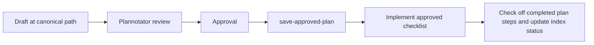

# Pi workflows

This page links the mandatory workspace policy to the detailed Pi operating guides. Start with [`AGENTS.md`](../../AGENTS.md), then read the nearest project `AGENTS.md` before changing project files.

## Plan and execute

Use Plannotator for non-trivial changes:

1. Start plan mode with `/plannotator` or `pi --plan`.
2. Create the first draft at `docs/prompts/YYYY_MM_DD_HHMM-slug/README.md`. Keep plan-related supporting Markdown, HTML, and image artifacts in that dated directory, and revise the plan through approval.
3. Submit it through Plannotator's browser review.
4. After approval, load `save-approved-plan`. It validates the plan path, allows plan-related supporting artifacts, and adds the index row in [`../prompts/README.md`](../prompts/README.md); it never copies, moves, or alters the archive.
5. Implement the approved checklist. Review the plan and its artifacts for durable conclusions, then capture applicable information in the appropriate living documentation. After each completed implementation step, change that step's checkbox from `- [ ]` to `- [x]` in the same plan file, then update the plan-index status as work progresses.

If a plan begins elsewhere, stop and ask rather than creating a second plan.

## Delegate

Load `pi-subagents` before orchestrating. The parent owns delegation, synthesis, final decisions, and follow-up work; ordinary children receive a concrete task and do not orchestrate more children.

Use [delegation.md](delegation.md) to select a role, choose a workflow, and apply single-writer and fresh-review guardrails. Assess documentation impact for every behavior, API, configuration, architecture, or workflow change; delegate substantial, cross-file, or user-facing documentation work to `technical-writer`.

## Prompt and MCP use

The repository prompt is `/architecture-check`; use it when frontend boundaries could change. Use `nx-run-tasks` or direct Nx commands for test and lint requests.

The DaisyUI MCP server is declared in [`.mcp.json`](../../.mcp.json) with `directTools: true`. Cached tools are callable directly; the first run without cached metadata uses the MCP proxy while it populates. Use search or describe when the proxy is active or when you need to discover the available surface.

## Review and completion

For implementation work:

1. Follow RED, GREEN, REFACTOR under the root and project `AGENTS.md` rules.
2. Run focused tests while editing.
3. Run the builtin reviewer and resolve accepted blocking findings.
4. Run Lens diagnostics on edited source and resolve new blockers.
5. Run `pnpm exec nx affected -t lint test --base=origin/main --parallel=3`.
6. Run `/architecture-check` when frontend boundaries could change.
7. Assess documentation impact, update the required documentation and architecture record, validate changed links, and use `technical-writer` when the documentation work is substantial, cross-file, or user-facing.

Report commands, outcomes, and residual risk; never imply a check ran when it did not.

See also: [Pi configuration](configuration.md), [extensions](extensions.md), and [agent skills](skills.md).
