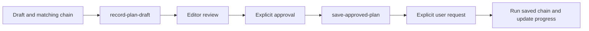

# Pi workflows

This page links the mandatory workspace policy to the detailed Pi operating guides. Start with [`AGENTS.md`](../../AGENTS.md), then read the nearest project `AGENTS.md` before changing project files.

## Plan and execute

Use an editor-reviewed Markdown plan for non-trivial changes:

1. The parent uses `pi-subagents` read-only context work and `planner` as needed, then creates a canonical `status: draft` plan at `docs/prompts/YYYY_MM_DD_HHMM-slug/README.md` and its matching plan-specific saved chain.
2. The parent runs `record-plan-draft`. It validates the canonical plan and chain and creates or retains one `📝 draft` row in [`../prompts/README.md`](../prompts/README.md). It does not infer approval or start work.
3. The user reviews the Markdown plan and matching chain in an editor. Approval is explicit: the user changes the plan to `status: approved` or directs the parent to record that status.
4. The parent runs `save-approved-plan`. It validates approval and promotes the existing draft row to `⬜ not started`; it never copies or moves the archive, or starts execution.
5. Only a separate explicit user request starts implementation. The parent then runs the matching saved chain and updates completed checklist items and index status from actual evidence.

If a plan begins elsewhere, stop and ask rather than creating a second plan.

### Saved plan chains

[`.pi/chains/saved-plans/`](../../.pi/chains/saved-plans/README.md) is reserved for plan-specific execution chains. Run one only when its linked canonical plan has explicit user approval and is registered in [`docs/prompts/README.md`](../prompts/README.md). The parent verifies these conditions before `/run-chain`; chain discovery does not enforce them.

## Delegate

Load `pi-subagents` before orchestrating. The parent owns delegation, synthesis, final decisions, and follow-up work; ordinary children receive a concrete task and do not orchestrate more children.

Use [delegation.md](delegation.md) to select a role, choose a workflow, and apply single-writer and fresh-review guardrails. Assess documentation impact for every behavior, API, configuration, architecture, or workflow change; delegate substantial, cross-file, or user-facing documentation work to `technical-writer`.

## Prompt and MCP use

The repository prompt is `/architecture-check`; use it when frontend boundaries could change. Use `nx-run-tasks` or direct Nx commands for test and lint requests.

The DaisyUI MCP server is declared in [`.mcp.json`](../../.mcp.json) with `directTools: true`. Cached tools are callable directly; the first run without cached metadata uses the MCP proxy while it populates. Use search or describe when the proxy is active or when you need to discover the available surface.

## Review and completion

For implementation work:

1. Follow RED, GREEN, REFACTOR under the root and project `AGENTS.md` rules.
2. Run focused tests while editing.
3. Run the builtin reviewer and resolve accepted blocking findings.
4. Run Lens diagnostics on edited source and resolve new blockers.
5. Run `pnpm exec nx affected -t lint test --base=origin/main --parallel=3`.
6. Run `/architecture-check` when frontend boundaries could change.
7. Assess documentation impact, update the required documentation and architecture record, validate changed links, and use `technical-writer` when the documentation work is substantial, cross-file, or user-facing.

Report commands, outcomes, and residual risk; never imply a check ran when it did not.

See also: [Pi configuration](configuration.md), [extensions](extensions.md), and [agent skills](skills.md).
